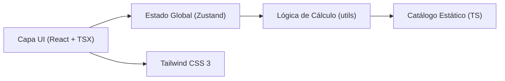

# Arquitectura Técnica: Calculadora de BTUs Mirage

## 1. Diseño de Arquitectura
Aplicación Frontend-only (React + Vite + TS) sin backend; todos los datos del catálogo son estáticos y el cálculo se realiza en cliente.



## 2. Descripción Tecnológica
- **Frontend**: React 18 + TypeScript + Vite
- **Estilos**: Tailwind CSS 3 (tokens de paleta Mirage)
- **Estado**: Zustand para el estado compartido (zona seleccionada, dimensiones, BTU, variante activa)
- **Íconos**: lucide-react
- **Rutas**: No requiere routing (single-page App de 1 vista principal con secciones ancladas)
- **Inicialización**: vite-init (template react-ts)
- **Backend**: Ninguno (lógica 100% cliente-side)
- **Base de datos**: Catálogo estático tipado en TypeScript

## 3. Definición de Rutas
| Ruta | Propósito |
|------|-----------|
| `/` (index) | Vista única: Header → Calculadora → Simulador → Catálogo Convencional → Catálogo Inverter → Footer |

## 4. Modelo de Datos

### 4.1 Tipos Principales (TypeScript)

```typescript
type ZonaClimatica = {
  id: 1 | 2 | 3 | 4;
  nombre: string;
  cargaBTUxM2: number;
  descripcion?: string;
};

type VarianteEquipo = {
  id: string;
  btu: number;
  voltaje: 110 | 220;
  seer: number | string;
  ahorro: string;
  ruidoDb: number | string;
  flujoAireM3h: number | string;
  compresor: string;
  gas: string;
  consumoWatts: number | string;
};

type SerieEquipo = {
  id: string;
  nombre: string;
  linea: "Convencional" | "Inverter";
  funcionesDestacadas: string[];
  variantes: VarianteEquipo[];
};
```

### 4.2 Constantes de Zonas Climáticas (Iniciales)
| Zona | Nombre Referencia | BTU/m² |
|------|-------------------|--------|
| 1 | Zona Norte (Templada) | 700 |
| 2 | Zona Centro | 800 |
| 3 | Zona Pacífico | 900 |
| 4 | Playa del Carmen (default) | 1000 |

### 4.3 Lógica de Cálculo
- Área = Largo × Ancho
- BTUs Requeridos (base para visualización) = Área × 1000 BTU/m²
- Para referencia lógica de zona: BTUs Zona = Área × cargaBTUxM2
- Simulador: cada celda = 1000 BTUs; pintar azul hasta alcanzar requerimiento, verde si capacidad del equipo > requerimiento, rojo si faltante.

## 5. Estructura de Archivos (src/)
```
src/
├── App.tsx                 # Composición principal de secciones
├── main.tsx                # Punto de entrada
├── index.css               # Tailwind + tokens globales
├── types/
│   └── catalogo.ts         # Interfaces SerieEquipo, VarianteEquipo, Zona
├── data/
│   ├── zonas.ts            # Datos de zonas climáticas
│   └── equipos.ts          # Catálogo completo (LIFE, XLIFE, MAGNUM, etc.)
├── utils/
│   └── calculos.ts         # Funciones puras de cálculo BTU y cobertura
├── store/
│   └── useCotizadorStore.ts # Zustand: estado global
├── components/
│   ├── MarcaHeader.tsx
│   ├── CalculadoraBTU.tsx
│   ├── SimuladorCobertura.tsx
│   ├── CatalogoSection.tsx
│   ├── SerieCard.tsx
│   ├── VarianteSelector.tsx
│   ├── FichaTecnica.tsx
│   └── MarcaFooter.tsx
```
