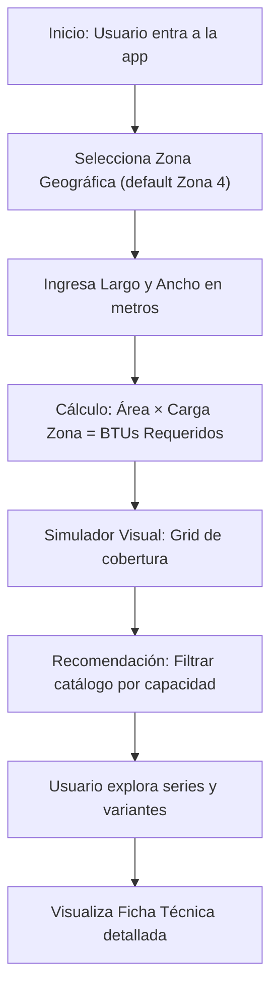

# PRD: Calculadora de BTUs Mirage

## 1. Visión General del Producto
Aplicación web interactiva en React que ayuda a clientes de Mirage a determinar la capacidad ideal (BTUs) de un aire acondicionado Minisplit para su espacio, mostrando recomendaciones personalizadas del catálogo oficial.
- Resuelve la incertidumbre del usuario al elegir un equipo AC, evitando compras por exceso o insuficiencia.
- Fortalece la identidad de marca Mirage y ofrece una experiencia premium de autoservicio.

## 2. Características Principales

### 2.1 Roles de Usuario
| Rol | Método de Registro | Permisos Core |
|-----|---------------------|----------------|
| Cliente / Visitante | Sin registro (app pública) | Calcular BTUs, explorar catálogo, ver fichas técnicas |

### 2.2 Módulos de Funcionalidad
1. **Página Principal (Calculadora)**: Encabezado de marca, selector de zona geográfica, entradas de dimensiones, cálculo de BTUs, simulador visual de cobertura.
2. **Catálogo de Equipos**: Tarjetas por línea (Convencional / Inverter), selector de variante (capacidad + voltaje), fichas técnicas detalladas.
3. **Sistema de Recomendación**: Filtrado automático de equipos que coinciden o superan la necesidad calculada.

### 2.3 Detalle de Páginas
| Página | Módulo | Descripción de Características |
|--------|--------|--------------------------------|
| Principal | Header de Marca | Logo Mirage, eslogan, paleta rojo/negra, tipografía Inter |
| Principal | Selector de Zona | 4 zonas climáticas (700–1000 BTUs/m²), Zona 4 default "Playa del Carmen" |
| Principal | Entrada de Dimensiones | Campos Largo (m) y Ancho (m), cálculo automático de área |
| Principal | Resultado BTUs | Muestra carga térmica total calculada (base 1,000 BTUs/m² para visualización) |
| Principal | Simulador de Cobertura | Grid interactivo (cada celda = 1,000 BTUs); colores: Azul (cubierto), Verde (reserva), Rojo (faltante) |
| Catálogo | Línea Convencional | Series LIFE 12+, XLIFE 2025 con funciones destacadas y selector de variante |
| Catálogo | Línea Inverter | Series MAGNUM 22, INVERTER X, MAGNUM 18, INVERTER 17 con selectores |
| Catálogo | Ficha Técnica | SEER, ahorro %, ruido dB, flujo aire m³/h, compresor, gas, consumo Watts |

## 3. Proceso Principal

El usuario ingresa dimensiones → el sistema calcula área → multiplica por carga de zona → obtiene BTUs totales → simulador visual compara contra capacidades → catálogo filtra y resalta equipos recomendados → usuario explora variantes y fichas técnicas.

## 4. Diseño de Interfaz de Usuario

### 4.1 Estilo de Diseño
- **Colores Primarios**: Rojo Mirage `#FF0004`, Negro `#000000`, blanco de fondo. Acentos: Azul `#1e40af`, Verde `#15803d`, Rojo de alerta.
- **Botones**: Relleno rojo solido con hover a tono más oscuro; bordes redondeados medianos; tipografía Inter Medium.
- **Tipografía**: Inter (100–900) — Display 700 para títulos, 500 para subtítulos, 400 para cuerpo, 300 para detalles.
- **Layout**: Tarjetas con sombras suaves, grid responsivo, secciones con divisores sutiles; enfoque desktop-first con adaptación móvil.
- **Iconos**: Lucide React (lineales, estilo minimalista).

### 4.2 Resumen de Diseño por Página
| Página | Módulo | Elementos UI |
|--------|--------|--------------|
| Principal | Hero / Calculadora | Tarjeta oscura con borde rojo, inputs con íconos, botón de acción primario |
| Principal | Simulador Grid | Celdas cuadradas con transiciones de color animadas, leyenda visual |
| Catálogo | Tarjetas de Serie | Encabezado con nombre y badge "Convencional/Inverter", lista de funciones, tabs selectoras de variante |
| Catálogo | Ficha Técnica | Tabla con filas alternas, métricas destacadas en negritas |

### 4.3 Responsividad
- **Desktop-first**: Diseñado para ≥1280px con layout de 2 columnas (calculadora + simulador) y catálogo en grid.
- **Tablet (768–1279px)**: Columnas se apilan verticalmente; grid de catálogo 2 columnas.
- **Móvil (<768px)**: Una columna completa; inputs full-width; simulador con celdas más pequeñas; navegación simplificada.
- **Optimización táctil**: Botones ≥44px, áreas de clic generosas.
